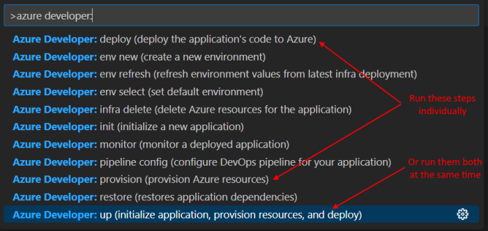

# AZD Command Line Deploy

The Azure Developer CLI (azd) is an open-source tool that accelerates the time it takes to get started on Azure. azd provides a set of developer-friendly commands that map to key stages in a workflow (code, build, deploy, monitor).

This project has been configured to work with AZD commands to make it fast and easy to deploy a demo.

---

## Configuration Secrets

This application requires a few secrets to be configured in the application before being deployed.

> *`Note 1: these settings are stored in clear text in the .env file in the .azure/<yourEnvironment> directory. Be sure to edit the .azure/.gitignore file to exclude the <yourEnvironment> directory from being checked into source control!`*

> *Note 2: the first time you run the azd command, you will be prompted for the Environment Name, Azure Subscription and Azure Region to use -- see section below for information on choosing a good Environment Name.*

The two key things that are required for this demo are the name of an **existing Azure OpenAI Resource**, and the **API Key** for that resource. You can set them by running the following commands.

```bash
    azd env set openAIResourceName <yourOpenAIAzureResourceName>
    azd env set openAIApiKey <yourOpenAIApiKey>
    azd env set dallEApiKey <yourDallEApiKey>
```

The SQL Server needs an Azure AD account to specify as the administrator of the SQL Server:

```bash
    azd env set adminLoginTenantId <yourTenantId>
    azd env set adminLoginUserId <yourUser@yourDomain.com>
    azd env set adminLoginUserSid <yourUserSID>
```

If you want your application to be authenticated, you will need to provide a Domain, TenantId and ClientId.  This is optional and only needed if you want to enable authentication.  If not specified, then anyone will be able to use the application, which would be fine if you are just doing a local demo. These values should point to an Azure Active Directory App Registration that is used to authorized this application. To add these values to the application, run the following commands:

```bash
    azd env set adDomain <yourDomain.onmicrosoft.com>
    azd env set adTenantId <yourTenantId>
    azd env set adClientId <yourClientId>
```

In order for the authentication to work properly, the App Registration Authentication Page will have to be updated to include the Redirect URI for local development and Azure deployment of the application. The Redirect URIs should look something like:

- `https://localhost:7078/signin-oidc`
- `https://xxx-chatgpt.azurewebsites.net/signin-oidc`

---

## Environment Names

When an AZD command is run for the first time, a prompt will ask for the "Environment Name", the Azure Subscription to use and the Azure Region to deploy to.

> *`NOTE: This "Environment Name" is NOT an environment code like [dev/qa/prod]!`*

Choose the "Environment Name" carefully, as it will be used as the basis to name all of the resources, so it must be unique. Use a naming convention like *[yourInitials]-[appName]* or *[yourOrganization]-[appName]* as the format for Environment Name. The resulting web application name `MUST` be globally unique.

For example, if Environment Name is equal to: 'xxx-chatgpt', AZD will create a Azure resources with these names:

| Azure Resource | Name                       | Uniqueness        |
| -------------- | -------------------------- | ----------------- |
| Resource Group |  rg-xxx-chatgpt            | in a subscription |
| Azure Website  |  xxx-chatgpt-azd           | global            |

Storage accounts and other resources will be named in a similarly fashion.

---

## AZD Commands

The five commands of most interest are:

- **azd up**: provisions Azure resources, builds app, and deploys it to Azure
- **azd provision**: provisions Azure resources but does not build and deploy the application
- **azd deploy**: builds the app and deploys it to existing Azure resources
- **azd down**: removes Azure resources create by this AZD command
- **azd env set**: sets an environment variable to be used by the main.bicep file

Typically a developer with either do the up command to do everything at once, or do the provision and deploy commands separately.

---

## Visual Studio Code

There is a Azure Developer CLI [extension](https://marketplace.visualstudio.com/items?itemName=ms-azuretools.azure-dev) available in Visual Studio Code. If that is installed, it is easy to pop up the command window like this:



---

## Command Line

These commands can also be run on the command line, like this:

```bash
> azd up
```

## Example Command Execution


### Resources Created


---

## Reference

[Azure Developer CLI Reference](https://learn.microsoft.com/en-us/azure/developer/azure-developer-cli/)

[Introducing the Azure Developer CLI - Azure SDK Blog](https://devblogs.microsoft.com/azure-sdk/introducing-the-azure-developer-cli-a-faster-way-to-build-apps-for-the-cloud/)

[Make your project compatible with Azure Developer CLI](https://learn.microsoft.com/en-us/azure/developer/azure-developer-cli/make-azd-compatible?pivots=azd-create)
